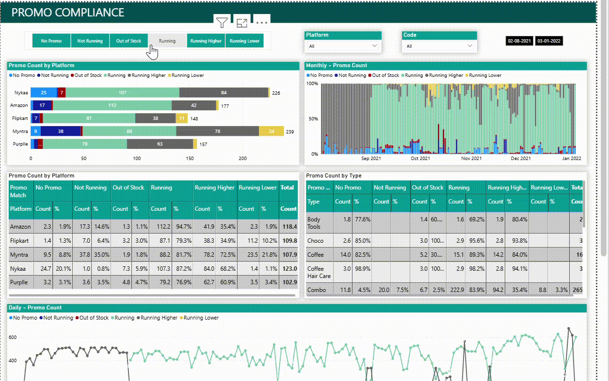
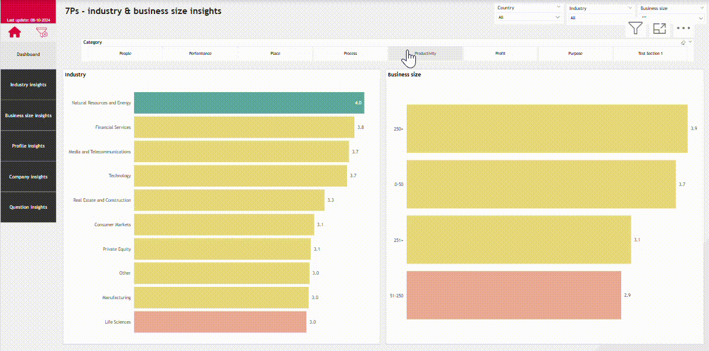

# Power-BI-Portfolio
Welcome to my Power BI portfolio repository! Here you will find a collection of Power BI projects and dashboards that demonstrate my skills and expertise in data visualization, business intelligence and analytics using Power BI.

## **1. Rating and reviews**
Rating and reviews report is a powerful data visualization tool built in Power BI to analyze a brand products' ratings and customer feedback on e-commerce websites like Amazon and Myntra.

## **2. Promotion compliance**
Powerful analyzing and tracking tool built in Power BI to analyze how well the promotional campaigns run on e-Commerce websites adhere to the business requirements. It helps in taking actions based on the number of promotions complaint across a brand products and categories.

<!--## **3. Best seller ranking report**
Best seller ranking report is a powerful tracking and analytical tool designed in Power BI to track and assess the performance of a brand products based on their rankings listed on Amazon's best seller page. It provides comparative insights into brand performance versus competitors, pinpointing key areas for improvement and driving strategic decision making to enhance market positioning.-->

## **3. Business lens**

## **4. Sales analysis**
The Sales Analysis report is built using dummy data, allowing you to demonstrate the design and wide range of visuals in Power BI effectively. This dummy data simulates realistic sales figures, hierarchies, and trends, ensuring the dashboard provides actionable insights while remaining generic.

